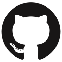

# Bartosz Art

**`Full-Stack Developer`**

I'm a Full-Stack Developer with 2 years of commercial experience. During this time, I worked as a freelancer, creating avariety of projects, including a registration and appointment management system for a dental clinic. This system handles patient registration, appointment booking, and supports several administrative processes, leading toincreased operational efficiency while maintaining high security standards. I independently designed,implemented, and deployed this system.  
I have strong knowledge of JavaScript/TypeScript, combined with a frontend framework (React), backend frameworks (Node.js, Express.js), or a fullstack framework (Next.js), supported by relational databases (MSSQL, MySQL, PostgreSQL) or NoSQL databases (MongoDB).

---

### Languages and Tools
<!--

   

-->

<!--
**ArtoszBart/ArtoszBart** is a ✨ _special_ ✨ repository because its `README.md` (this file) appears on your GitHub profile.

Here are some ideas to get you started:

- 🔭 I’m currently working on ...
- 🌱 I’m currently learning ...
- 👯 I’m looking to collaborate on ...
- 🤔 I’m looking for help with ...
- 💬 Ask me about ...
- 📫 How to reach me: ...
- 😄 Pronouns: ...
- ⚡ Fun fact: ...
-->
